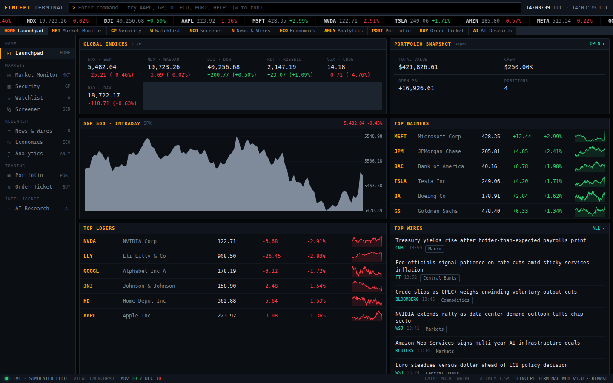

# FINCEPT TERMINAL — Web

A modern, browser-based **remake** of [FinceptTerminal](https://github.com/Fincept-Corporation/FinceptTerminal)
— a Bloomberg-style financial research & trading terminal.

The upstream project is a native C++20 / Qt6 desktop application. This remake
recreates its identity and core workflows as a single-page web app built with
**React + TypeScript + Vite**, using a self-contained mock market engine so it
runs fully offline with zero API keys.



## Features

- **Command bar** — Bloomberg-style command line. Type a ticker (`AAPL`) to jump
  to a security, or a function code (`GP`, `MKT`, `N`, `ECO`, `ANLY`, `PORT`,
  `AI`, `HELP`) to switch modules.
- **Launchpad** — global indices, S&P intraday, portfolio snapshot, top movers,
  and a live news rail.
- **Market Monitor** — sortable multi-asset board (equities, indices, crypto, FX,
  commodities, rates) with a sector heat-map, bid/ask, volume and trend sparklines.
- **Security** — candlestick + line charts with a volume subplot, selectable
  ranges (1M–1Y), L1 order book, key statistics and tagged headlines.
- **Watchlist** — persisted (localStorage), add/remove with symbol autocomplete.
- **Screener** — filter the universe by asset class, % change and P/E.
- **News & Wires** — categorized feed with sentiment, plus an economic calendar.
- **Economics** — FRED-style macro series browser and the US Treasury yield curve.
- **Analytics** — portfolio risk (annualized return, volatility, Sharpe, max
  drawdown, historical VaR) and a two-stage DCF valuation calculator.
- **Portfolio + Order Ticket** — a MetaTrader-style **margin account**: balance,
  equity, floating P&L, used/free margin and margin level, with selectable
  **leverage (1:1 – 1:500)** and **long or short** positions. Market/limit orders,
  an equity curve, and a fills blotter tagging each fill YOU vs AI (persisted).
- **AI Auto-Trader (ALGO)** — an autonomous paper-trading agent. It scores every
  instrument from SMA(20/50) trend, 10-day momentum and RSI(14), then trades your
  paper book within your risk limits (risk-per-trade, max position, cash reserve,
  max trades/cycle, cycle interval, aggression). Start/stop it, watch a live signals
  table and a decision log with the rationale behind every fill. Runs even when
  you're on another screen.
- **AI Research** — a rule-based analyst that reasons over the terminal's data
  **and can trade for you**: natural-language orders ("buy 10 AAPL", "sell all
  TSLA", "close NVDA"), autopilot control ("start/stop AI trading"), and
  "rebalance my book" to run a cycle on demand — plus analysis, comparison,
  portfolio review and metric explainers.

### Data: simulated by default, live optional

By default the terminal runs on a **deterministic mock market engine**
(`src/data/market.ts`) — seeded 1-year OHLC histories with simulated ticks, so
charts, quotes, risk metrics and AI answers stay internally consistent with no
network or API keys.

Toggle **LIVE** (button in the command bar, or type `LIVE` / `SIM`) to pull real,
free, **no-key** data from **Yahoo Finance** for the whole universe (equities,
indices, crypto, FX, commodities, the 10Y yield). Browsers can't call Yahoo
directly (no CORS), so requests go to `/api/yahoo/*`, which the Vite dev server
proxies server-side (`vite.config.ts`). Therefore:

- **Live data works when you run the app yourself** with `npm run dev` (or
  `npm run preview`), where your machine reaches Yahoo.
- The **hosted/static build and the sandboxed Artifact cannot fetch live data**
  (their security policy blocks all external calls). There the LIVE toggle
  degrades gracefully — per symbol — back to the simulator, and the status bar
  shows how many symbols are live vs simulated.

Open the **DATA** tab (or type `DATA`) to choose a feed provider:

- **Yahoo (no key)** — whole universe, via the dev proxy (dev/preview only).
- **Finnhub (API key)** — paste a free [finnhub.io](https://finnhub.io/register)
  token. Finnhub's quote API is **CORS-enabled**, so live prices work directly
  from the browser on **any normal deployment** (and dev/preview) with no proxy.
  Free tier covers US stocks & ETFs (real-time quotes layered on the chart);
  other classes stay simulated. The key is stored only in your browser
  (localStorage) and sent only to Finnhub. The one place live data can't run is
  the sandboxed claude.ai Artifact, whose policy blocks all external requests.

Every symbol falls back to simulated data individually if its live fetch fails,
so the terminal never breaks. All trading is **paper money only — not investment
advice.**

## Tech stack

- React 18 + TypeScript, bundled with Vite 5
- Zero UI/runtime dependencies beyond React — charts are hand-drawn on `<canvas>`
- State persisted to `localStorage`

## Getting started

```bash
cd fincept-terminal-web
npm install
npm run dev        # http://localhost:5173
```

Build / preview a production bundle:

```bash
npm run build
npm run preview    # http://localhost:4173
```

## Project structure

```
fincept-terminal-web/
├── index.html
├── src/
│   ├── main.tsx / App.tsx        # entry + shell, command routing
│   ├── styles.css                # terminal theme (amber-on-black)
│   ├── components/               # CommandBar, Sidebar, Ticker, StatusBar,
│   │                             # Panel, canvas charts
│   ├── data/                     # symbols, market engine (sim+live), news,
│   │                             # macro, providers.ts (Yahoo live feed)
│   ├── lib/                      # hooks, store, quant math, AI assistant,
│   │                             # trader.ts (signals + auto-trader), nav
│   └── modules/                  # Dashboard, Markets, Security, Watchlist,
│                                 # Screener, News, Economics, Analytics,
│                                 # Portfolio, Trade, AlgoTrader, Chat
```

## Disclaimer

All market data is **simulated** for demonstration. Nothing here is investment
advice, and it is not affiliated with Fincept Corporation or Bloomberg L.P.
This is an independent, educational remake inspired by the original project.
